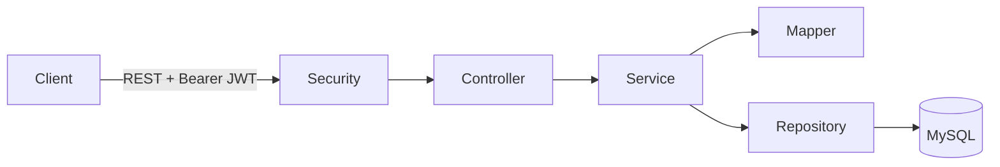
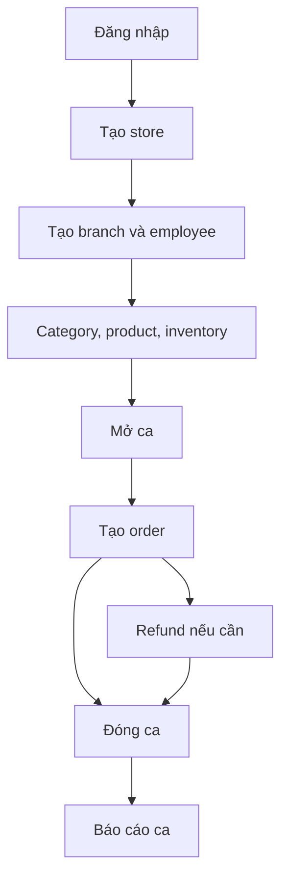

# SaaS POS Application

Backend REST API cho hệ thống Point of Sale nhiều cửa hàng/chi nhánh, viết bằng Spring Boot, Spring Security JWT, Spring Data JPA và MySQL.

## Chức năng

- Xác thực JWT, quản lý người dùng và role
- Cửa hàng, chi nhánh và nhân viên
- Danh mục, sản phẩm và tồn kho theo chi nhánh
- Khách hàng, đơn hàng và hoàn tiền
- Mở/đóng ca; thống kê sales, refund, payment type và top sản phẩm
- Locale Việt/Anh qua header `Accept-Language`

## Kiến trúc



Tài liệu đầy đủ: **[WORKFLOWS.md](src/dosc/WORKFLOWS.md)**.

## Công nghệ và yêu cầu

- Java 17, Spring Boot 4.0.1, Maven Wrapper
- Spring MVC, Security, Data JPA, Validation
- JJWT 0.12.6, MySQL, Lombok
- MySQL 8+ và JDK 17

## Chạy local

```sql
CREATE DATABASE sass_pos_db CHARACTER SET utf8mb4 COLLATE utf8mb4_unicode_ci;
```

Cấu hình DB hiện nằm tại `src/main/resources/application.properties`. Trước production, hãy chuyển password DB và JWT secret sang environment variable.

```bash
bash mvnw spring-boot:run
```

Ứng dụng mặc định chạy tại `http://localhost:5000`.

## Sử dụng nhanh

```bash
curl -X POST http://localhost:5000/auth/signup \
  -H 'Content-Type: application/json' \
  -d '{"fullName":"Owner","email":"owner@example.com","password":"change-me","role":"ROLE_STORE_ADMIN"}'

curl -X POST http://localhost:5000/auth/login \
  -H 'Content-Type: application/json' \
  -d '{"email":"owner@example.com","password":"change-me"}'

curl http://localhost:5000/api/users/profile \
  -H 'Authorization: Bearer <jwt>' \
  -H 'Accept-Language: vi'
```

## Workflow chính



## Test

```bash
bash mvnw test
```

Project hiện mới có context test cơ bản. Phiên bản hiện tại phù hợp học tập/phát triển tiếp; xem các rủi ro production trong tài liệu workflow.
