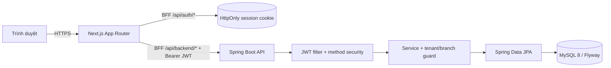

# Kiến trúc

## Thành phần



`sass-pos-web` là frontend Next.js. Các route handler đăng nhập, đăng ký, đăng xuất và proxy backend chạy phía server. JWT từ backend được giữ trong cookie `sass_pos_session` có cờ `HttpOnly`; JavaScript của trình duyệt không nhận JWT trong response BFF và không dùng `localStorage` hay `sessionStorage` để lưu token.

`Sass-Pos-Application` là REST API Spring Boot. `JwtValidation` xác thực Bearer token trước controller, còn `@PreAuthorize` và service guard quyết định role và phạm vi store/branch. JPA truy cập MySQL; Flyway quản lý schema cho cài đặt mới.

## Luồng yêu cầu

```mermaid
sequenceDiagram
    actor User
    participant UI as Next.js UI
    participant BFF as Next.js route handler
    participant API as Spring API
    participant DB as MySQL

    User->>UI: Thao tác nghiệp vụ
    UI->>BFF: /api/backend/...
    BFF->>BFF: Đọc HttpOnly session cookie
    BFF->>API: Authorization: Bearer JWT
    API->>API: Xác thực, role và tenant scope
    API->>DB: Transaction / query
    DB-->>API: Kết quả
    API-->>BFF: JSON hoặc ApiError
    BFF-->>UI: JSON; xóa cookie khi upstream trả 401
```

Browser chỉ gọi BFF cùng origin. Trong Docker Compose, BFF gọi backend qua hostname nội bộ `http://backend:5000`; biến `SPRING_API_URL` không phải biến `NEXT_PUBLIC_*` nên không được đưa vào bundle browser.

## Tenant và dữ liệu giao dịch

Tenant là `Store`; `Branch` thuộc `Store`. Catalog, customer, employee, inventory và giao dịch đều liên kết với store/branch tương ứng. Các service core kiểm tra quan hệ đó thay vì tin hoàn toàn vào ID do client gửi.

- Product, category và customer được ràng buộc với store.
- Inventory là duy nhất theo cặp branch/product và có optimistic version; khi bán hoặc hoàn tiền, service dùng truy vấn lock để điều chỉnh tồn kho và ghi `inventory_movement`. Báo cáo biến động tồn kho aggregate audit trail này trong scope tenant/branch thay vì tin số liệu frontend.
- Order lấy giá bán từ product trong database, yêu cầu ca đang mở và `Idempotency-Key`; branch/cashier được suy ra từ tài khoản hiện tại.
- Refund kiểm tra số lượng chưa hoàn, ghi dòng refund, hoàn tồn kho và chuyển trạng thái order thành `PARTIALLY_REFUNDED` hoặc `REFUNDED`.

## Cấu trúc mã nguồn

| Vị trí                                                       | Vai trò                                                            |
| ------------------------------------------------------------ | ------------------------------------------------------------------ |
| `Sass-Pos-Application/src/main/java/com/tindev/controller`   | REST boundary và method authorization                              |
| `Sass-Pos-Application/src/main/java/com/tindev/service/impl` | nghiệp vụ, transaction và tenant guard                             |
| `Sass-Pos-Application/src/main/java/com/tindev/modal`        | JPA entity                                                         |
| `Sass-Pos-Application/src/main/resources/db/migration`       | Flyway schema migration                                            |
| `sass-pos-web/src/app/api`                                   | BFF auth và backend proxy                                          |
| `sass-pos-web/src/features/management`                       | CRUD, POS, order, refund, shift và báo cáo sales/biến động tồn kho |
| `sass-pos-web/src/lib/auth/roles.ts`                         | map điều hướng/quyền hiển thị phía client                          |

Quyền hiển thị ở frontend chỉ để cải thiện trải nghiệm. Backend vẫn là điểm quyết định quyền truy cập.
