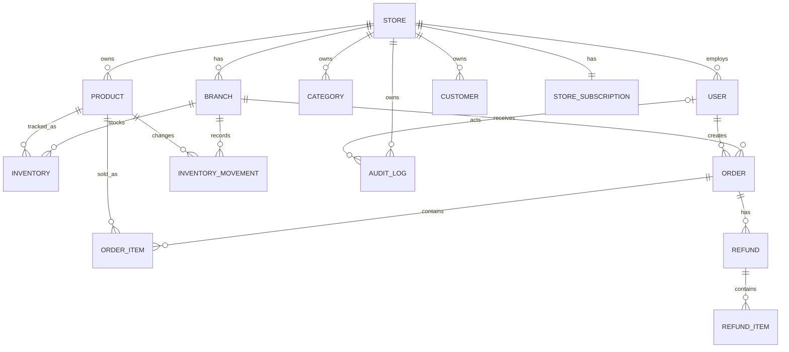

# Database và migration

## Quy tắc schema

- MySQL 8 là database production.
- Flyway chạy migration trong `src/main/resources/db/migration` theo thứ tự version.
- `spring.jpa.hibernate.ddl-auto` mặc định `validate`; production không phụ thuộc vào `update`.
- Không sửa migration đã áp dụng cho môi trường shared/production. Tạo version mới, ví dụ `V3__...sql`.

## Migration hiện có

| Version                                     | Nội dung                                                                                                                                           |
| ------------------------------------------- | -------------------------------------------------------------------------------------------------------------------------------------------------- |
| `V1__initial_saas_pos_schema.sql`           | schema core store, branch, users, catalog, inventory, customer, order, refund và shift                                                             |
| `V2__add_inventory_movement_audit.sql`      | bảng audit `inventory_movement`, foreign keys và indexes theo branch/product/thời gian                                                             |
| `V3__add_store_subscription.sql`            | bảng `store_subscription`, một subscription cho mỗi store, trạng thái/chu kỳ/trial và backfill subscription `FREE` trial 14 ngày cho store hiện có |
| `V4__add_audit_log.sql`                     | bảng `audit_log` cho audit nghiệp vụ generic; index theo store/thời gian và entity                                                                 |
| `V5__add_audit_log_filter_indexes.sql`      | indexes theo action/thời gian và thời gian/id cho truy vấn audit phân trang/filter                                                                 |
| `V6__normalize_store_status_constraint.sql` | chuẩn hóa `store.status` sang enum string và sửa dữ liệu ordinal/NULL cũ                                                                           |
| `V7__add_global_catalog_and_inventory_transfer.sql` | thêm trạng thái catalog dùng chung và nghiệp vụ yêu cầu điều chuyển tồn kho nội bộ                                                        |
| `V8__expand_product_text_columns.sql`        | mở rộng cột mô tả/ảnh sản phẩm để không bị cắt dữ liệu                                                                                             |
| `V9__allow_store_admin_multiple_stores.sql`  | bỏ ràng buộc một chủ chỉ có một cửa hàng                                                                                                           |
| `V10__add_profit_and_stock_thresholds.sql`   | giá vốn sản phẩm/order/refund và ngưỡng cảnh báo tồn kho                                                                                           |
| `V11__add_workforce_management.sql`          | lịch làm việc, chấm công và bảng lương                                                                                                             |
| `V12__add_payroll_attendance_calculation.sql` | đơn giá giờ, phút công dùng để tính và lưu dấu vết bảng lương                                                                                     |

Chỉ có một migration `V2`; không thêm migration có version trùng vì Flyway sẽ dừng startup.

## Quan hệ chính

## Tính đúng đắn giao dịch

- `inventory` có constraint unique `(branch_id, product_id)` và version.
- Order/refund gọi service inventory trong transaction, dùng lock database trước khi thay đổi quantity.
- `inventory_movement` giữ before/after/delta/type/reason/actor/time; `GET /api/reports/inventory-movements` aggregate audit trail này theo tenant/branch và khoảng ngày, không thay đổi bản ghi audit.
- Số tiền dùng `DECIMAL(19,2)` và `BigDecimal`.
- `orders.idempotency_key` unique để retry checkout không tạo order trùng.
- `store_subscription` có unique `store_id`; plan hiện là `FREE`, `BASIC` hoặc `PRO`, còn status là `TRIALING`, `ACTIVE`, `PAST_DUE`, `CANCELED`, `EXPIRED`. Các cột Stripe ID chỉ được đồng bộ từ Checkout/webhook đã xác thực; nullable vì Stripe có thể đang tắt hoặc store chỉ dùng FREE.
- `audit_log` có thể không có `store_id` hoặc `actor_id`; khi xóa store log bị cascade, còn khi xóa user trường actor được đặt `NULL` để giữ lịch sử còn lại.

## Subscription và Stripe

Migration V3 chỉ tạo và backfill dữ liệu subscription nội bộ. Checkout/Customer Portal/webhook nằm ở service runtime, không nằm trong migration; webhook bắt buộc xác thực chữ ký trước khi đồng bộ subscription. Không đưa Stripe credential vào migration hay seed data. Việc có cột Stripe ID không xác nhận store đã thanh toán; xem [checklist external integration](external-integrations.md).

## Local development và migration dữ liệu cũ

Backend mặc định dùng `ddl-auto=validate` và `baseline-on-migrate=false`: schema chỉ thay đổi qua Flyway. Để chạy local mà không động vào database legacy `sass_pos_db`, dùng profile `dev`; profile này trỏ tới database `sass_pos_dev` và Flyway sẽ áp dụng từ V1 đến V12.

Nếu database hiện có được tạo bằng Hibernate `update`, backup trước và kiểm tra từng migration trên staging trước khi baseline. Không bật `FLYWAY_BASELINE_ON_MIGRATE` đại trà: baseline chỉ ghi một mốc lịch sử, không làm các migration sau mốc đó tự tương thích với schema cũ.

`V6` sửa lỗi schema local cũ có check constraint kiểu ordinal (thường có tên `store_chk_1`) khiến insert trạng thái `PENDING` bị từ chối. Khi backend khởi động lại với Flyway bật, migration tự chuyển giá trị `0/1/2` và `NULL` sang `ACTIVE`/`PENDING`/`BLOCKED`, sau đó dùng MySQL `ENUM` tương thích với `@Enumerated(EnumType.STRING)`.
