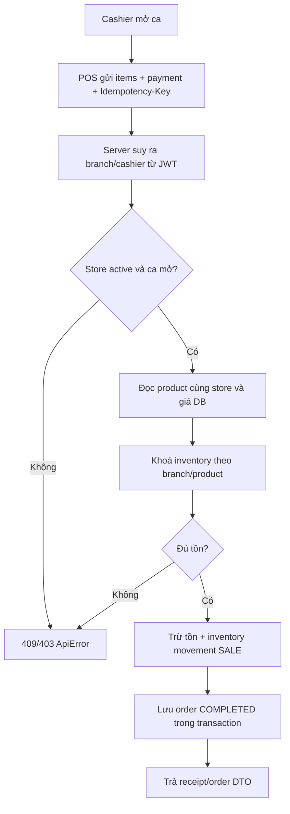
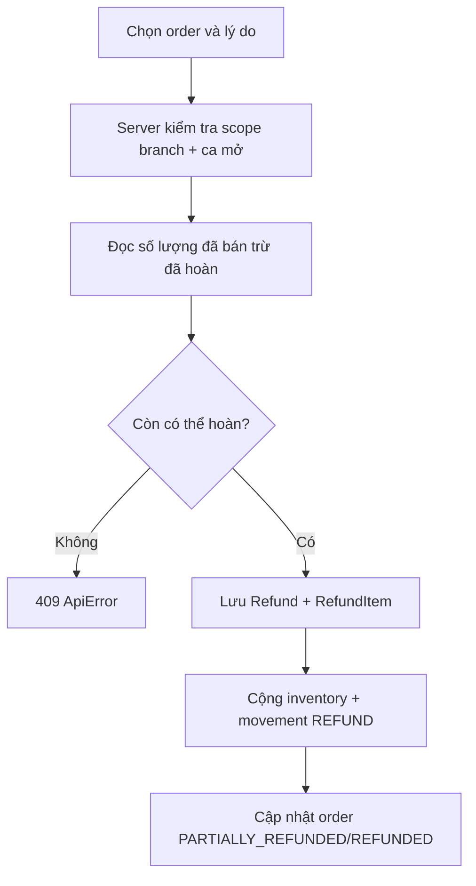

# Workflow hiện tại của SaaS POS

Tài liệu này mô tả hành vi đã được triển khai trong source hiện tại. Xem `docs/architecture.md`, `docs/auth.md`, `docs/permissions.md` và `docs/database.md` để biết chi tiết kỹ thuật.

## Xác thực qua BFF

```mermaid
sequenceDiagram
    actor User
    participant Browser
    participant BFF as Next.js BFF
    participant API as Spring API
    User->>Browser: Login/signup
    Browser->>BFF: POST /api/auth/login hoặc signup
    BFF->>API: POST /auth/login hoặc signup
    API-->>BFF: JWT + user
    BFF-->>Browser: HttpOnly sass_pos_session; payload đã lọc JWT
    Browser->>BFF: /api/backend/api/...
    BFF->>API: Bearer JWT
    API-->>BFF: DTO hoặc ApiError
```

`signup` chỉ tạo `ROLE_STORE_ADMIN`. Frontend không lưu JWT trong `localStorage` hoặc `sessionStorage`.

## Luồng bán hàng



Retry cùng `Idempotency-Key` trả order đã tạo; không tạo thêm order.

## Luồng refund



Amount/refund item price được tính từ dữ liệu order server, không tin giá hoặc amount client gửi.

## Vận hành

1. Store admin tạo/được duyệt store, tạo branch, nhân viên, category, product và inventory.
2. Cashier/manager mở ca trước khi POS hoặc refund.
3. Cuối ca đóng shift; dashboard, báo cáo doanh thu/lợi nhuận và báo cáo biến động tồn kho lấy dữ liệu server theo tenant/branch scope. Báo cáo tồn kho aggregate `inventory_movement`, không phải dữ liệu do UI tính.
4. Quản lý xếp lịch/chấm công; bảng lương có thể dùng lương cố định hoặc tự tính từ phút công đã hoàn thành và đơn giá giờ. Việc xác nhận trả lương chỉ ghi trạng thái nghiệp vụ, không tự chuyển tiền.
5. Lịch sử hóa đơn hỗ trợ xem chi tiết, in và xuất CSV. Báo cáo hỗ trợ CSV/Excel/PDF theo phạm vi quyền.
6. Chạy `GET /actuator/health` để kiểm tra backend. Docker Compose chờ MySQL/backend healthy trước service phụ thuộc.

## Giới hạn có chủ đích

Stripe Checkout/Portal/webhook và UploadThing đã có code nhưng vẫn cần credential test hợp lệ để xác minh với dịch vụ thật. VietQR hiện là QR chuyển khoản và thu ngân xác nhận thủ công, chưa có webhook ngân hàng. POS offline/offline order queue chưa có. Bảng lương chưa xử lý thuế, bảo hiểm, làm thêm giờ hoặc chuyển khoản thực. Một số chuỗi giao diện mới vẫn chưa được đưa hết vào bộ từ điển Việt/Anh. Không có workflow giả tạo thanh toán subscription thành công.
