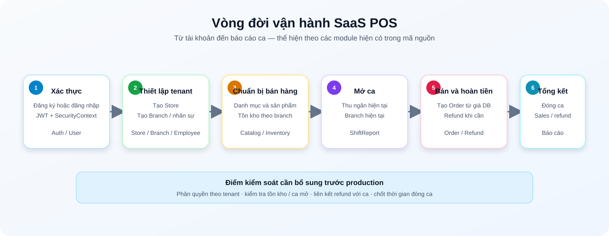
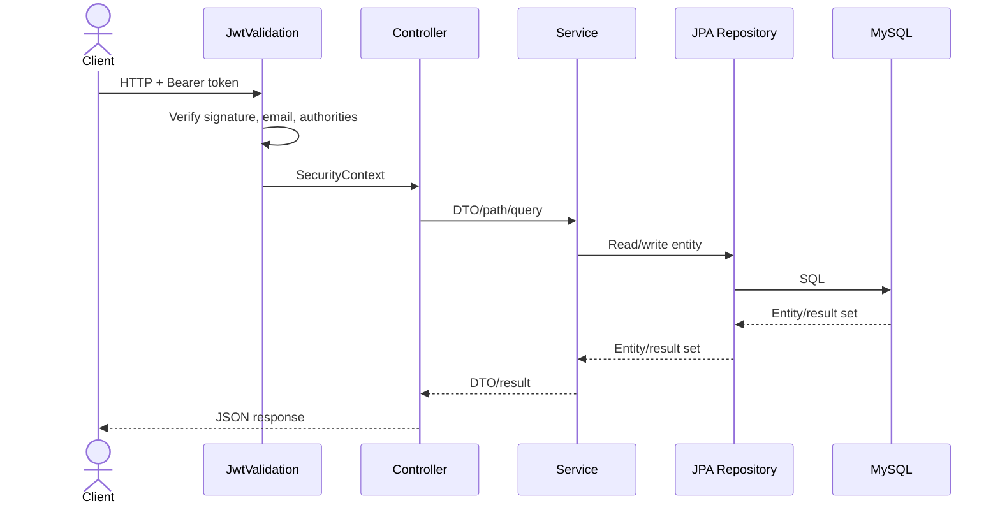
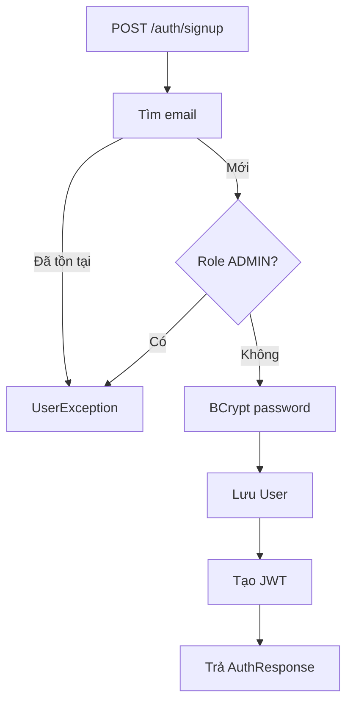
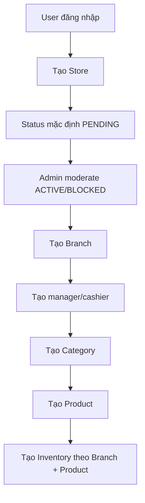
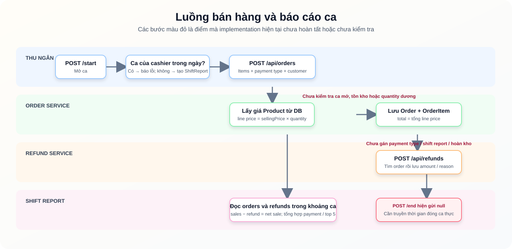
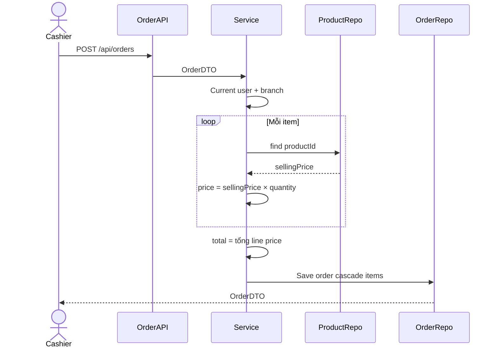
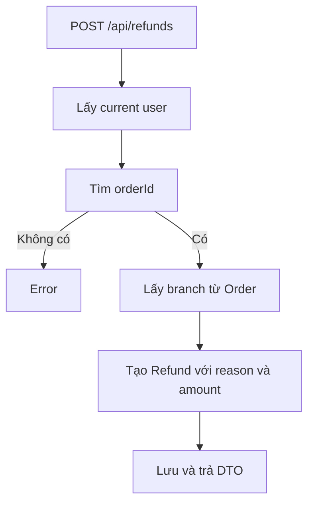
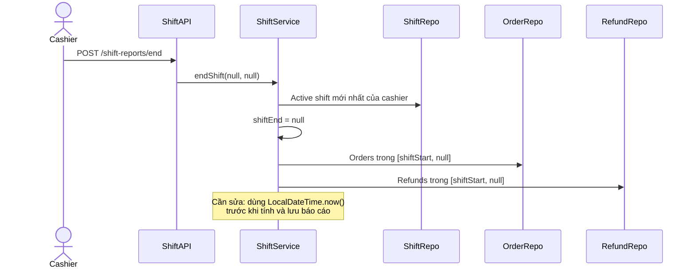
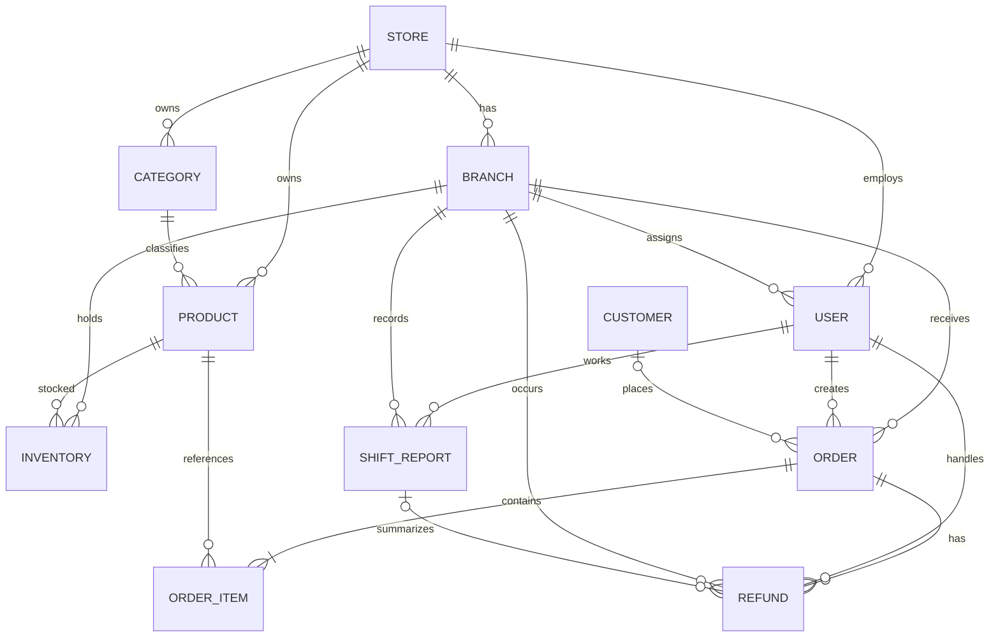

# Workflow và sơ đồ hệ thống SaaS POS

Tài liệu này được dựng từ controller, service, repository và JPA entity trong mã nguồn hiện tại. Nó mô tả **hành vi đang có trong code**, không phải toàn bộ hành vi mong muốn khi đưa vào production.

> **Xem Preview:** Hai sơ đồ SVG dưới đây hiển thị trực tiếp như hình trong hầu hết Markdown Preview. Các khối `mermaid` cũng render thành sơ đồ trên GitHub và VS Code Markdown Preview có hỗ trợ Mermaid.

## Sơ đồ xem nhanh



Sơ đồ này cho thấy thứ tự nghiệp vụ dự kiến: xác thực → thiết lập cửa hàng → chuẩn bị catalog/tồn kho → mở ca → bán/hoàn tiền → tổng kết ca. Các phần sau phân tách rõ bước nào đã có trong code và bước nào còn giới hạn.

## 1. Tổng quan

### Actor

| Role | Trách nhiệm dự kiến |
|---|---|
| `ROLE_ADMIN` | Quản trị toàn SaaS; không được tự signup |
| `ROLE_STORE_ADMIN` | Chủ/quản trị cửa hàng |
| `ROLE_STORE_MANAGER` | Quản lý cửa hàng |
| `ROLE_BRANCH_MANAGER` | Quản lý chi nhánh |
| `ROLE_BRANCH_CASHIER` | Mở ca, bán hàng, refund, đóng ca |

### Module

| Module | Chức năng |
|---|---|
| Auth/User | Signup, login, JWT, profile |
| Store/Branch/Employee | Tenant, địa điểm bán và nhân sự |
| Category/Product/Inventory | Catalog và tồn kho từng branch |
| Customer/Order/Refund | Giao dịch bán hàng |
| ShiftReport | Tổng hợp một ca thu ngân |

### Luồng request



## 2. Workflow xác thực

### Signup



Client hiện tự chọn mọi role trừ `ROLE_ADMIN`. JWT khi **login** chứa `email`, `authorities`, hết hạn sau 8.400.000 ms. `/api/**` yêu cầu đăng nhập; `/auth/**` public.

> **Hạn chế hiện tại:** `signup` tạo `Authentication` không kèm authorities trước khi phát JWT, nên token trả về sau signup có thể không chứa role. Đăng nhập lại tạo token đúng quyền; cần sửa luồng signup trước khi dùng thật.

## 3. Workflow khởi tạo cửa hàng



- Update store kiểm tra current user là `storeAdmin`.
- Branch manager tạo từ store bắt buộc có `branchId` và được gán làm manager branch.
- Tạo employee trực tiếp tại branch chỉ nhận cashier/branch manager.
- SKU unique toàn database. Inventory chưa unique theo cặp branch/product.
- Tạo Store hiện chỉ gán `Store.storeAdmin`; chưa gán ngược `User.store`, nên các API dựa vào `currentUser.store` có thể chưa có dữ liệu.

## 4. Workflow bán hàng



### Mở ca

1. `POST /api/shift-reports/start` lấy current user từ SecurityContext.
2. Tìm shift của user trong ngày; nếu có thì báo `Shift already started today`.
3. Lấy branch từ user, tạo `ShiftReport(shiftStart, cashier, branch)` và lưu.

### Tạo order



Cashier/branch được suy ra từ JWT. Giá lấy từ database. Code chưa kiểm tra ca mở, tồn kho, quantity dương, product thuộc store, hoặc trạng thái store. `customerId` không được resolve; service dùng object `customer` trong body.

### Refund



`paymentType` và `shiftReportId` có trong entity/DTO, nhưng `createRefund` hiện chưa gán hai field này. Refund cũng chưa validate amount, chưa hoàn kho và chưa cập nhật order.

### Đóng ca



```text
totalSales  = Σ order.totalAmount
totalRefund = Σ refund.amount
netSale     = totalSales - totalRefund
totalOrder  = số order trong ca
```

Đây là công thức service dự định áp dụng. Tuy nhiên, endpoint `POST /end` đang gọi `endShift(null, null)`: service bỏ qua `shiftReportId`, gán `shiftEnd = null`, rồi truy vấn với mốc kết thúc `null`. Vì vậy luồng đóng ca **chưa hoạt động đúng**. Sau khi sửa để dùng `LocalDateTime.now()`, cần giữ kiểm tra sales bằng 0 để phép chia phần trăm payment không sinh `NaN`.

## 5. ERD



### Enum

- UserRole: `ROLE_ADMIN`, `ROLE_STORE_ADMIN`, `ROLE_BRANCH_CASHIER`, `ROLE_BRANCH_MANAGER`, `ROLE_STORE_MANAGER`
- StoreStatus: `ACTIVE`, `PENDING`, `BLOCKED`
- PaymentType: `CASH`, `UPI`, `CARD`
- OrderStatus: `PENDING`, `COMPLETED` nhưng entity Order chưa có field này

Enum hiện không dùng `@Enumerated(EnumType.STRING)`, nên JPA có thể lưu ordinal. `Customer` không thuộc Store, gây thiếu tenant isolation.

## 6. Danh mục API

| Nhóm | Endpoint |
|---|---|
| Auth | `POST /auth/signup`, `POST /auth/login` |
| User | `GET /api/users/profile`, `GET /api/users/{id}` |
| Store | `POST/GET /api/stores`, `GET /admin`, `GET /employee`, `GET/PUT/DELETE /{id}`, `PUT /{id}/moderate` |
| Branch | `POST /api/branches`, `GET/PUT/DELETE /{id}`, `GET /store/{storeId}` |
| Employee | `POST /store/{storeId}`, `POST /branch/{branchId}`, `PUT/DELETE /{id}`, `GET /store/{id}`, `GET /branch/{id}` |
| Category | `POST /api/categories`, `GET /store/{storeId}`, `PUT/DELETE /{id}` |
| Product | `POST /api/products`, `GET /store/{storeId}`, `PATCH/DELETE /{id}`, `GET /store/{storeId}/search?keyword=` |
| Inventory | `POST /api/inventories`, `PUT/DELETE /{id}`, `GET /branch/{branchId}`, `GET /branch/{branchId}/product/{productId}` |
| Customer | `POST/GET /api/customers`, `PUT/DELETE /{id}`, `GET /search?q=` |
| Order | `POST /api/orders`, `GET /{id}`, `/branch/{id}`, `/cashier/{id}`, `/today/branch/{id}`, `/customer/{id}`, `/recent/{id}` |
| Refund | `POST/GET /api/refunds`, `GET /{id}`, `/cashier/{id}`, `/branch/{id}`, `/shift/{id}`, `/cashier/{id}/range` |
| Shift | `POST /start`, `POST /end`, `GET /current`, `/cashier/{id}`, `/cashier/{id}/by-date`, `/branch/{id}`, `/{id}` |

Header chuẩn:

```http
Authorization: Bearer <jwt>
Content-Type: application/json
Accept-Language: vi
```

## 7. Lỗi và khoảng trống tìm thấy

| Vấn đề | Hiện trạng / hướng sửa |
|---|---|
| Credential | DB password và JWT secret hard-code; chuyển sang environment variables và rotate |
| Authorization | Rule role dùng `/api/super-admin/**`, `/api/admin/**`, `/api/cashier/**`; role `STORE_OWNER`/`CASHIER` cũng không khớp enum hiện tại. Phần lớn URL controller hiện chỉ cần authenticated; thêm method-level authorization |
| Tenant isolation | Nhiều API không kiểm tra store/branch thuộc current user |
| Inventory lookup | Controller truyền `(branchId, productId)` nhưng service khai báo `(productId, branchId)` |
| Delete category | Controller gọi `updateCategory`, không gọi delete |
| Update employee | Set field rồi trả `null`, không save/encode password |
| Order status | Filter nhận status nhưng entity không có status và không filter |
| Recent orders | Endpoint recent gọi orders hôm nay thay vì top 5 recent |
| Delete order | Service chỉ find, không delete |
| Delete refund | Gọi `deleteById` hai lần |
| Tiền tệ | Dùng `Double`; nên dùng `BigDecimal` |
| Shift snapshots | Cascade `Product`/`Order` từ ShiftReport có rủi ro; nên dùng projection/snapshot riêng |
| Đóng ca | Controller truyền `null` cho cả ID và `shiftEnd`, khiến truy vấn tổng kết ca có cận trên `null`; dùng thời điểm server hiện tại và kiểm tra ca của cashier |
| Validation | Thiếu `@Valid`, quantity/amount checks và global exception handler |
| Database | Nên dùng Flyway/Liquibase thay `ddl-auto=update` trong production |

## 8. Test cần bổ sung

- Unit test cho service/mapper và security test theo từng role.
- Integration test với Testcontainers MySQL.
- Luồng mở ca → order → refund → đóng ca.
- Tenant isolation giữa hai store.
- Hai cashier đồng thời bán cùng SKU và transaction/locking tồn kho.
- Empty shift, refund vượt giá trị order, product khác store, duplicate inventory.
